# TAE-STA — Transferência de Arquivos Enterprise

<div align="center">


</div>

<p align="center">
<b>Enterprise File Transfer Service</b><br>
Windows Service • .NET 10 • PostgreSQL • React • Clean Architecture
</p>

<p align="center">
  
</p>

<p align="center">
Serviço Windows para automatizar a transferência de arquivos entre servidores, com janela de execução configurável, fan-out multi-destino, compactação 7-Zip, rename por destino, registro detalhado por arquivo e painel web completo.
</p>

---

## ✨ Recursos

* Transferência automática de arquivos entre servidores (UNC paths)
* Janela de execução configurável por etapa
* Fan-out para múltiplos destinos
* Compactação/descompactação 7-Zip (Fast mode)
* Rename por destino com placeholders (`{NAME}`, `{DATE}`, `{TIME}`, `{EXT}`)
* Registro detalhado por arquivo (log granular)
* Pause/Resume do Worker sem restart
* **API REST completa** (38 endpoints, JWT, Rate Limiting)
* **Frontend React** (Dashboard, CRUD, Logs, Auditoria)
* **Segurança**: AD/LDAP (Samba) + BCrypt fallback + Roles (Admin/Operator/Viewer)
* **Audit trail**: registra quem fez o quê no sistema (somente Admin)
* Cobertura de testes automatizados (114 testes)
* **Browse SFTP remoto** (explorar pastas e arquivos do servidor parceiro)

---

## 🚀 Subindo o ambiente

```bash
# 1. Infraestrutura (Postgres + Samba AD)
docker compose up -d

# 2. Criar/atualizar tabelas
cd src/STA.Worker
dotnet ef database update

# 3. Executar API (porta 5000)
dotnet run --project src/STA.Api

# 4. Executar Worker
dotnet run --project src/STA.Worker

# 5. Executar Frontend (porta 3000)
cd src/STA.Web
npm install
npm run dev

# 6. Executar testes
dotnet test STA.sln
```

**Login:** credenciais no `appsettings.Development.json` (gitignored)

> **Ambientes**
>
> * **Desenvolvimento:** utiliza `appsettings.Development.json` (gitignored).
> * **Produção:** utiliza variáveis de ambiente (`STA_DB_CONN`, `Jwt:Secret`, etc.).

---

## 📁 Estrutura do projeto

```text
src/
├── STA.Core/            # Domínio, entidades, repositórios, serviços
├── STA.Worker/          # Serviço Windows (BackgroundService + Migrations)
├── STA.Api/             # API REST (Controllers, DTOs, Auth, Audit)
├── STA.Web/             # Frontend React (Vite + Tailwind + Zustand)
└── STA.Database/        # SQL de referência

tests/
└── STA.Tests/           # 79 testes (xUnit + Moq + EF In-Memory)

docker-compose.yml       # PostgreSQL + Samba AD
STA.sln                  # Solução principal
DOCS.md                  # Documentação técnica completa
```

---

## 🏗️ Arquitetura

```text
┌─────────────────────────────────────────────┐
│              Frontend (React)               │
│         Dashboard • CRUD • Logs • Audit     │
└──────────────────────┬──────────────────────┘
                       │ HTTP/JWT
┌──────────────────────▼──────────────────────┐
│              API REST (.NET 10)             │
│  Auth • Etapas • Rotas • Destinos • Worker  │
│  Logs • Auditoria • Diretórios • Health     │
└──────────────────────┬──────────────────────┘
                       │
┌──────────────────────▼──────────────────────┐
│              Core (Services)                │
│  FileTransfer • Compress • Auth • Audit     │
└──────────────────────┬──────────────────────┘
                       │
┌──────────────────────▼──────────────────────┐
│           Infrastructure                    │
│   PostgreSQL • File System • 7-Zip • LDAP   │
└─────────────────────────────────────────────┘
```

---

## 🔐 Segurança

| Camada | Implementação |
|--------|---------------|
| Autenticação | AD/LDAP (Samba) + fallback BCrypt local |
| Autorização | JWT com Roles (Admin/Operator/Viewer) |
| Rate Limiting | 5 req/min login, 100 req/min geral |
| Bloqueio | 5 tentativas → bloqueia 15 min |
| Headers | X-Content-Type-Options, X-Frame-Options, etc. |
| Auditoria | Tabela `tbl_auditoria` (quem fez o quê) |
| Storage | sessionStorage (morre ao fechar aba) |

---

## 📈 Roadmap

### Nível 1 — TAE-STA Local ✅

* ✅ Migração para .NET 10
* ✅ PostgreSQL + EF Core (code-first)
* ✅ Worker Service com janela horária
* ✅ Transferência com fan-out + compactação
* ✅ Log granular por arquivo
* ✅ API REST completa (38 endpoints)
* ✅ Frontend React (Dashboard, CRUD, Logs)
* ✅ Segurança (AD/LDAP + BCrypt + Roles + Rate Limiting)
* ✅ Rename por destino (placeholders)
* ✅ Audit trail (quem fez o quê)

### Nível 2 — TAE-STA Connect (em progresso)

* ✅ CI/CD pipeline (GitHub Actions + Release automático)
* ✅ SFTP como protocolo de destino (conexões agendáveis, pool por ciclo)
* ✅ Logs SFTP dedicados (tabela + tela)
* ✅ Scheduler por conexão (horários pontuais + dias da semana)
* ⏳ Notificações (email/Teams em falhas)

### Nível 3 — TAE-STA Exchange (futuro)

* ⏳ Entrega ponta-a-ponta com handshake (ACK/NACK)
* ⏳ Rastreio de recebimento pelo destinatário
* ⏳ SLA e monitoramento de entregas

---

## 💡 Sobre o projeto

O TAE-STA representa a modernização de um serviço legado originalmente desenvolvido em **VB.NET Framework 2.0**, migrado para **.NET 10** utilizando uma estratégia de refatoração incremental orientada por testes.

O objetivo foi preservar o comportamento da aplicação durante toda a migração, evoluindo gradualmente a arquitetura, aumentando a cobertura de testes e preparando a solução para futuras funcionalidades como SFTP e CI/CD.

---

## 📜 Licença

Projeto privado desenvolvido para fins de estudo, modernização de software legado e demonstração técnica.
